# Photo Engine v1

Photo Engine intentionally does not know how VK authorization works. It prepares
`Submission.media_asset_id`; a future sender will consume that reference. No VK
requests, credentials, uploads, sending, or usage-history updates are involved.

## Workflow and boundaries

```mermaid
flowchart LR
    A[Prepared Campaign] --> B[GridCommunity category]
    B --> C[PhotoQueryBuilder]
    C --> D[Existing MediaAsset library]
    D --> E[Cached PhotoProvider search if needed]
    E --> F[Metadata ranking and shortlist]
    F --> G[Bounded download and image validation]
    G --> H[Normalize and deduplicate]
    H --> I[LocalMediaStorage and MediaAsset]
    I --> J[Submission media assignment]
```



Implementation lives in `backend/src/dropgrid/photos/`. `PhotoCandidate` is the
typed provider-neutral metadata/provenance boundary. `PhotoProvider.search`
returns candidates and safe rate information. Only `PixabayPhotoProvider` maps
Pixabay JSON. `FakePhotoProvider` and HTTP MockTransport support offline tests.
The API lifespan owns separate pooled search/download clients and closes both.

`PhotoQueryBuilder` normalizes Unicode, whitespace, case and ё/е. Curated Russian
categories include trucks, tractors, cars, motorcycles, nature, animals, dogs,
cats, love, dating and quotes, with ordered Russian/English variants. Unknown
categories use their normalized text. Empty categories use a nature query.
The category comes from the selected Grid's **GridCommunity**, preserving import
semantics; `Community.category` never overwrites it. Library categories are
normalized; category filtering in the Media API matches the stored value.

## Pixabay requirements verified on 2026-10-08

Official sources: [API documentation](https://pixabay.com/api/docs/),
[Content License summary](https://pixabay.com/service/license-summary/) and
[Terms / full license](https://pixabay.com/service/terms/).

Operational rules:

- Use the official API only, without scraping or private endpoints.
- Cache matching searches for at least 24 hours.
- Default API allowance is 100 requests per 60 seconds per key; honor rate headers.
- Searches originate from an explicit campaign-planning action. No background crawler.
- Download only chosen images needed for the campaign plus a small validation allowance.
- Keep used images locally; never permanently hotlink CDN files in the UI.
- Identify Pixabay as source, retain creator/page/license provenance.
- Stock licenses have prohibited uses and may not cover third-party rights. Do not
  imply endorsement or use recognizable people misleadingly or in sensitive contexts.

This summary is not a legal guarantee. Review the current source license and
context before publication. No automatic attribution is added to a VK caption.
`requires_publication_attribution` and `attribution_text` retain future providers'
publication requirements.

The adapter uses `GET https://pixabay.com/api/` with `image_type=photo`,
`safesearch=true`, `order=popular`, `orientation=all`, language `ru`/`en`,
minimum width/height 850 and `per_page=75`. Automated plans use only page 1 and
at most three query variants per category, stopping when the pool is adequate.
The typed search model can represent a bounded second page for future adapters
and tests; there is no deep-pagination job. All used parameters enter the cache key.

`largeImageURL` is the documented normal-access download field (up to 1280px).
Original `imageWidth`/`imageHeight` are metadata, not a promise about downloaded
dimensions: actual decoded bytes must meet policy. Full-access-only URLs are not
required or constructed. The documented contributor profile format is used;
profile photographs are never downloaded.

## Persistent cache and rate control

`photo_search_cache` stores typed sanitized candidates, expiry and short-lived
coalescing leases. SHA-256 keys include provider and normalized complete search
parameters, never API credentials. Cache lifetime is configurable **24–168 hours**
and survives process restarts and credential rotation. Expired entries refresh on
demand; entries expired for seven days are opportunistically removed. Empty
successful responses are cached too. Error bodies are never cached.

Identical concurrent searches coalesce across API processes through PostgreSQL
row locks and 60-second leases. Waits/HTTP occur after transaction commit. Failed
or cancelled searches release the lease; a crashed process's lease expires.
`photo_provider_state` reserves conservative request slots across replicas,
initially one request/second. It adjusts spacing from `X-RateLimit-Limit` and
persists cooldowns from `X-RateLimit-Remaining` / `X-RateLimit-Reset`. A 429 stops
further provider searches in that plan; there is no automatic aggressive retry.
Provider-wide gating is deliberately conservative when multiple keys are used.

Without `PIXABAY_API_KEY` the app starts normally. Planning reuses valid library
assets and returns partial results with `provider_unavailable`, rather than a
configuration exception. Requests that actually reached a provider, and cache
hits, are counted separately.

## Ranking and content policy

`PhotoRanker` deterministically combines query/tag overlap, variant priority,
provider position, resolution, ratio fit, image-size sanity, modest popularity,
historical use, last-use timestamp, pending assignments and creator repetition.
Tie breaks use provider/asset identity. Selection prefers creator diversity;
assignment prefers unused campaign assets, balances reuse, avoids consecutive
repeats when alternatives exist and penalizes historical/current use. UUIDs are
stable final tie-breakers, not unseeded randomness.

Dating queries use flowers, sunsets and landscapes for providers permitting
that context. Pixabay's full Terms expressly include dating services among
prohibited contexts. V1 conservatively disables Pixabay searching and assignment
for dating categories (`provider_context_restricted`), including library reuse.
This is a conservative product policy, not a determination about every community.
The provider capability and license policy live outside the neutral planner;
future providers must explicitly permit sensitive context before participating.
A conservative tag filter
rejects explicit human/portrait terms in English and Russian for dating-related
categories. **This is a first-line metadata policy, not a person/biometric
detector**, and cannot guarantee the absence of recognizable people. Safe-search
does not certify licensing, model consent or suitability for every context.
Love and quotes use symbolic/background themes instead of profile imagery.
Social-network scraping, profile images and deceptive impersonation are outside
the provider contract.

## Download and image policy

`PhotoPolicy` centralizes defaults: HTTPS only; exact trusted hosts `pixabay.com`
and `cdn.pixabay.com`; JPEG/PNG/WebP; 850px minimum short side; maximum ratio 2.5;
20MiB input; 40 million decoded pixels; 2560px output maximum dimension; JPEG
quality 92; 8MiB output; dHash Hamming distance <=4; at most three redirects;
25-second total download timeout; 300-second network planning deadline.

850px is close to the requested 900px target while allowing the documented
1280px rendition of common 3:2 photographs. 1280×720 is intentionally rejected.
API resolution filters are an initial metadata filter; actual bytes decide.

Backend URLs originate solely from trusted candidates, never public request
bodies. Every redirect undergoes the same host/scheme/IP checks. DNS resolves
only to global unicast IPs; private, reserved, multicast, loopback and link-local
destinations are rejected. The dedicated HTTP transport pins the checked IP at
the actual TCP connection while retaining original TLS SNI, hostname validation
and Host. Pools are separated by original host. No environment proxy or automatic
redirect is used. Streaming checks declared and actual byte lengths. Compressed
download responses are rejected to avoid unbounded decompression before checks.

Pillow verifies the allowed single-frame format before decoding, enforces pixel
and dimension limits, applies EXIF orientation, flattens transparency on white,
normalizes RGB, downsizes without upscaling, and exports stable JPEG bytes without
EXIF/GPS or arbitrary metadata. SHA-256 and ImageHash dHash are computed from the
normalized image. Decode/normalization/storage work runs outside the event loop
under the same bounded download semaphore (default four, maximum six).

## Storage, database and deduplication

`MediaStorage` is a replaceable boundary; `LocalMediaStorage` is v1.
`MEDIA_STORAGE_DIR` defaults to `media` relative to the backend working directory.
Keys are `<sha[:2]>/<sha>.jpg`. Strict key validation and resolved-root checks
reject traversal and symlink escapes. Temporary files are flushed/fsynced then
atomically renamed. Writing the same SHA is idempotent and verifies existing data.

Migration `ead5fe0be527` adds nullable provenance/dimensions/hash fields to existing
MediaAsset rows. Existing columns, enums, FKs and submission history remain intact.
Only the new attribution flag has a non-null server default (`false`). Legacy
rows survive migration, but are not automatically assigned until quality and
provenance metadata and content are valid.

Unique constraints protect `(provider, provider_asset_id)` and normalized SHA;
PostgreSQL allows multiple NULLs on legacy rows. `media_provider_imports` maps
additional provider identities to an existing exact/near duplicate, retaining
source/creator/license provenance and preventing repeated downloads for aliases.
No second media system is introduced. Perceptual dedup is verified before writing
a new content file. Imports use a short PostgreSQL advisory transaction lock to
prevent cross-campaign hash/alias races. Exact/near duplicates are reusable only
when enabled, quality/sensitive policy and provider/license/attribution agree.
Disabled or incompatible duplicates are rejected, not silently resurrected.

The DB and filesystem cannot commit atomically together. A crash after an atomic
file write but before DB commit can leave an orphan file; it is safe to inventory
unreferenced keys during maintenance after stopping planners. Do not remove files
while active imports are committing. Normal retries are content-addressed.

## Assignment and concurrency

Plans require a prepared (`ready`) campaign. A durable campaign lease serializes
planning across API replicas without keeping a transaction open during network
work. Another concurrent plan gets a safe 409 and can be retried manually.
Lease lifetime is ten minutes; the network phase is limited to five minutes.
Snapshot and final assignment are short transactions. The final transaction
revalidates lease, campaign lifecycle, grid categories, assignments and enabled
assets. Concurrent import/prepare changes cannot silently overwrite assignments.

`max_reuse_per_asset=3` is a **per-campaign ceiling across categories**, not a
target. Prefer unique assets, then balanced reuse up to the ceiling; never lower
quality to fill every submission. The shortlist downloads at most the number of
missing unique assets plus `PHOTO_DOWNLOAD_SPARE` (default three) per category.
Library assets are used first; a sufficiently sized library makes no provider
request. At most four downloads/normalizations run at once across plans in a
process. Imported valid assets remain reusable if a later plan phase fails.

Default `force=false` preserves all previous assignments and history, including
those above a newly reduced ceiling; it never adds more references above that
ceiling. `force=true` regenerates only pending assignments and can clear them if
no valid image remains; nonpending submissions are preserved. It is an explicit
API option, not the normal UI button behavior. Neither mode changes submission
status, attempt count, account assignment, `usage_count` or `last_used_at`.
Actual-use counters belong to a future sender after successful use.

Partial results include category counts and fixed warning codes for missing
configuration, provider rejection/outage/rate limit, insufficient photos, bad
images, storage failure or planning timeout. No raw HTTP/provider/error body is
returned. Campaign lifecycle remains ready. No sender is started automatically.

## API and UI

- `POST /api/v1/campaigns/{campaign_id}/media/plan`:
  `{"max_reuse_per_asset":3,"force":false}` (both optional).
- `GET /api/v1/media-assets`: page/page_size and category/provider/enabled filters.
- `GET /api/v1/media-assets/{id}`: safe provenance/metadata; no filesystem path.
- `GET /api/v1/media-assets/{id}/content`: DB UUID lookup and validated local JPEG.

Plan responses contain total/previous/new/unassigned counts, unique/downloaded/
reused counts, provider requests/cache hits and category breakdowns. Campaign
stats persist assigned/unique counts after page reload. The prepared-campaign
button «Подобрать фото» shows progress and full/partial results; submissions show
local thumbnails. Media Library has filters, provenance, creator, dimensions,
usage, enabled state and source/license links. Pixabay source credit is shown.
No raw candidate gallery or permanent external image hotlink is used.

Safe structured events: `photo.plan.started`, `photo.query.cache_hit`,
`photo.provider.search`, `photo.provider.rate_limited`, `photo.candidate.selected`,
`photo.asset.downloaded`, `photo.asset.deduplicated`, `photo.plan.completed`,
`photo.plan.partial`. Only category/provider/campaign IDs, counts and durations
belong in logs; credentials, image bytes and external response bodies do not.

## Setup, persistence and extension

Get your key from the official [Pixabay API page](https://pixabay.com/api/docs/)
after signing in. Put `PIXABAY_API_KEY=...` in ignored **backend/.env** for host
development. Never send it through the frontend/public API or commit it. For
Compose, set the backend-only variable through ignored root `.env` or deployment
environment; `MEDIA_STORAGE_DIR` is `/app/media` inside the API container.

Apply migrations using the existing uv workflow, start backend/frontend, import
a grid, create and Prepare a campaign, then click «Подобрать фото».
Compose uses persistent `media_data`. Ordinary `docker compose down` retains it;
`down -v` intentionally destroys it together with other named volumes. **A DB
backup without the media-volume backup is not a complete DropGrid backup.**
Backup the DB and media consistently while planners are quiescent.

To add another official licensed provider, implement `PhotoProvider`, map safe
typed candidates/provenance inside its adapter, supply its download host policy
and rate requirements, and compose it with SearchCache and the existing planner.
There is no `if provider == "pixabay"` in the planner. A future fallback adapter
can implement the same protocol. Pexels/Openverse/Unsplash and semantic ML rankers
are not implemented in v1.

Normal tests prohibit real HTTP globally. Unit tests exercise queries, mapping,
ranking, bounds, pinning, image processing and storage. PostgreSQL tests cover
nonempty legacy migrations, persistent cache/coalescing, shared rate cooldowns,
hash/alias uniqueness, concurrent plans/imports, category precedence, partial
results, idempotency/force and content/library endpoints. Frontend tests cover
the automated button, progress/results, local thumbnails, provenance and filters.

### Observable visual profiling

Photo Lab shows visual-engine status explicitly. Null visual scores retain the
metadata fallback, with a visible warning; a missing candidate embedding does
not disable other candidates. CORE references are selected from compatible,
enabled style references in the last 180 days. Exact/near duplicates collapse;
density is the mean of the five nearest other images. With eight unique images
or more, the top 75% (at least six) form CORE; smaller sets retain all unique
references. Historical references remain available as AUX.

Reference study uses durable PostgreSQL jobs. Start its read-only worker:

```bash
docker compose --profile reference-study up -d reference-study
# Or from backend/, with the same DB/storage/model configuration as the API:
python -m dropgrid.photos.reference_worker
```

The UI polls `/communities/{id}/references/jobs/latest`; enqueue uses
`POST /communities/{id}/references/jobs`. Progress persists through page reload.
The worker cannot instantiate a sender and forces VK writes off. Expired jobs
can resume bounded read-only collection; each job has at most two executions.
